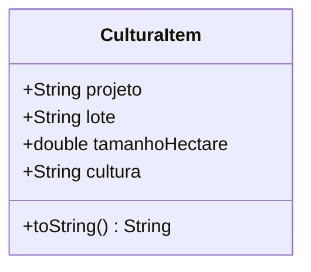

# CulturaItem

## Descrição
Classe auxiliar usada internamente na `CadastroClientePage` para representar um projeto/cultura do cliente durante o cadastro.

## Estrutura

## Relacionamentos

### Uso
- `CadastroClientePage` --> `CulturaItem` : gerencia lista

## Observações
- Classe auxiliar temporária usada apenas durante o cadastro
- Não é persistida diretamente, deve ser convertida para `ClienteCulturaModel` ou `ProjetoModel` + `LoteModel` + `LoteCulturaModel`
- Usada para facilitar a entrada de dados no formulário

