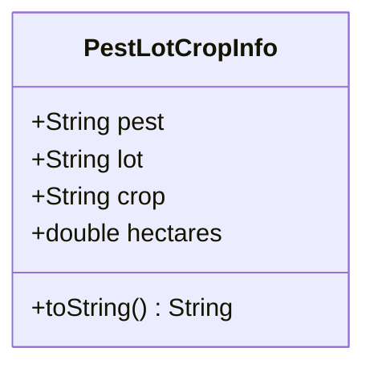

# PestLotCropInfo

## Descrição
Classe auxiliar usada internamente na `ExecuteAppointmentPage` para representar informações de praga, lote e cultura identificadas durante uma visita.

## Estrutura

## Relacionamentos

### Uso
- `ExecuteAppointmentPage` --> `PestLotCropInfo` : gerencia lista

## Observações
- Classe auxiliar temporária usada apenas durante a execução de visita
- Não é persistida diretamente, deve ser convertida para modelos apropriados
- Usada para facilitar a entrada de dados sobre pragas identificadas

