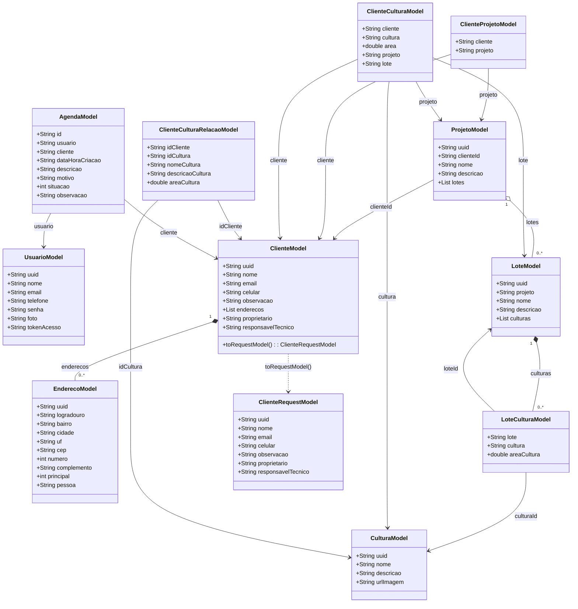

## Domain Models - Class Diagram

Generated on: 2025-11-26

```mermaid
classDiagram
  direction TB

  class UsuarioModel {
    +String uuid
    +String nome
    +String email
    +String telefone
    +String senha
    +String foto
    +String tokenAcesso
  }

  class ClienteModel {
    +String uuid
    +String nome
    +String email
    +String celular
    +String observacao
    +List<EnderecoModel> enderecos
    +String proprietario
    +String responsavelTecnico
    +toRequestModel(): ClienteRequestModel
  }

  class EnderecoModel {
    +String uuid
    +String logradouro
    +String bairro
    +String cidade
    +String uf
    +String cep
    +int numero
    +String complemento
    +int principal
    +String pessoa
  }

  class ProjetoModel {
    +String uuid
    +String clienteId
    +String nome
    +String descricao
    +List<LoteModel> lotes
  }

  class LoteModel {
    +String uuid
    +String projeto
    +String nome
    +String descricao
    +List<LoteCulturaModel> culturas
  }

  class LoteCulturaModel {
    +String lote
    +String cultura
    +double areaCultura
  }

  class CulturaModel {
    +String uuid
    +String nome
    +String descricao
    +String urlImagem
  }

  class ClienteProjetoModel {
    +String cliente
    +String projeto
  }

  class ClienteCulturaModel {
    +String cliente
    +String cultura
    +double area
    +String projeto
    +String lote
  }

  class ClienteCulturaRelacaoModel {
    +String idCliente
    +String idCultura
    +String nomeCultura
    +String descricaoCultura
    +double areaCultura
  }

  class ClienteRequestModel {
    +String uuid
    +String nome
    +String email
    +String celular
    +String observacao
    +String proprietario
    +String responsavelTecnico
  }

  class AgendaModel {
    +String id
    +String usuario
    +String cliente
    +String dataHoraCriacao
    +String descricao
    +String motivo
    +int situacao
    +String observacao
  }

  ClienteModel "1" *-- "0..*" EnderecoModel : enderecos
  ProjetoModel "1" o-- "0..*" LoteModel : lotes
  LoteModel "1" *-- "0..*" LoteCulturaModel : culturas
  LoteCulturaModel --> CulturaModel : culturaId
  LoteCulturaModel --> LoteModel : loteId

  ProjetoModel --> ClienteModel : clienteId
  ClienteProjetoModel --> ClienteModel : cliente
  ClienteProjetoModel --> ProjetoModel : projeto

  ClienteCulturaModel --> ClienteModel : cliente
  ClienteCulturaModel --> CulturaModel : cultura
  ClienteCulturaModel --> LoteModel : lote
  ClienteCulturaModel --> ProjetoModel : projeto

  ClienteCulturaRelacaoModel --> ClienteModel : idCliente
  ClienteCulturaRelacaoModel --> CulturaModel : idCultura

  AgendaModel --> UsuarioModel : usuario
  AgendaModel --> ClienteModel : cliente

  ClienteModel ..> ClienteRequestModel : toRequestModel()
```

