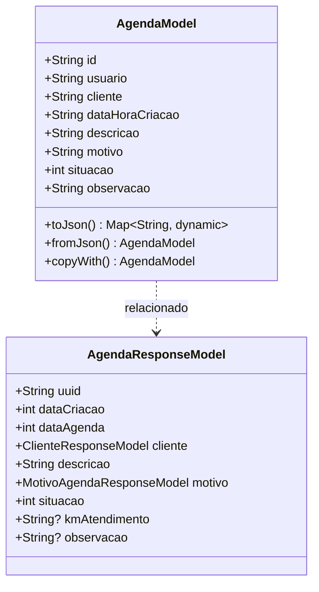

# AgendaModel

## Descrição
Modelo de domínio que representa um agendamento/compromisso de visita.

## Estrutura

## Relacionamentos

### Referências
- `AgendaModel` --> `UsuarioModel` : referencia (via campo usuario)
- `AgendaModel` --> `ClienteModel` : referencia (via campo cliente)

## Páginas que Usam
- `DashboardPage` - Exibe compromissos (via AgendaResponseModel)
- `AppointmentPage` - Cria agendamento
- `ExecuteAppointmentPage` - Atualiza/executa agendamento

## Observações
- Implementa `EquatableMixin` para comparação de igualdade
- Campo `situacao` representa o status do agendamento (enum)
- `AgendaResponseModel` é usado para resposta da API com dados aninhados
- Serialização JSON via `json_annotation`

