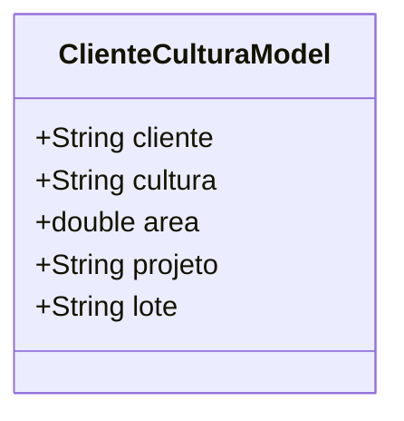

# ClienteCulturaModel

## Descrição
Modelo de domínio que representa o relacionamento entre um cliente, cultura, projeto e lote, incluindo a área.

## Estrutura

## Relacionamentos

### Referências
- `ClienteCulturaModel` --> `ClienteModel` : referencia (via campo cliente)
- `ClienteCulturaModel` --> `CulturaModel` : referencia (via campo cultura)
- `ClienteCulturaModel` --> `ProjetoModel` : referencia (via campo projeto)
- `ClienteCulturaModel` --> `LoteModel` : referencia (via campo lote)

## Observações
- Representa uma tabela de relacionamento entre Cliente, Cultura, Projeto e Lote
- Campo `area` indica a área em hectares
- Não possui UUID próprio, usa chave composta

