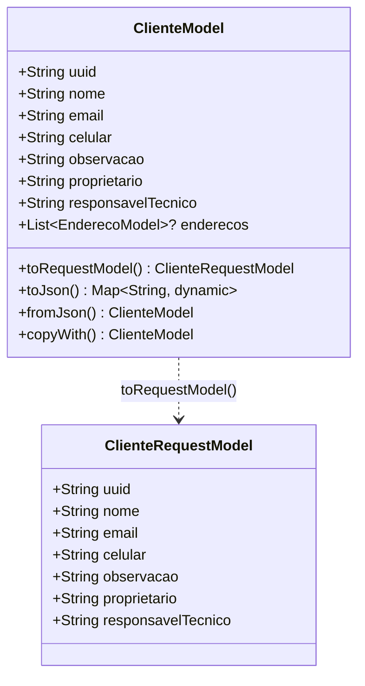

# ClienteModel

## Descrição
Modelo de domínio que representa um cliente do sistema.

## Estrutura

## Relacionamentos

### Composição
- `ClienteModel` "1" *-- "0..*" `EnderecoModel` : possui endereços

### Referências
- `ProjetoModel` --> `ClienteModel` : pertence a
- `AgendaModel` --> `ClienteModel` : referencia
- `ClienteCulturaModel` --> `ClienteModel` : referencia

## Páginas que Usam
- `RelacaoClientePage` - Lista clientes
- `CadastroClientePage` - Cria/edita cliente
- `ClientAppointmentPage` - Seleciona cliente
- `AppointmentPage` - Referencia via parâmetros
- `ExecuteAppointmentPage` - Referencia via parâmetros
- `DashboardPage` - Referencia via agenda

## Observações
- Implementa `EquatableMixin` para comparação de igualdade
- Possui método `toRequestModel()` para conversão em modelo de requisição
- Serialização JSON via `json_annotation`

