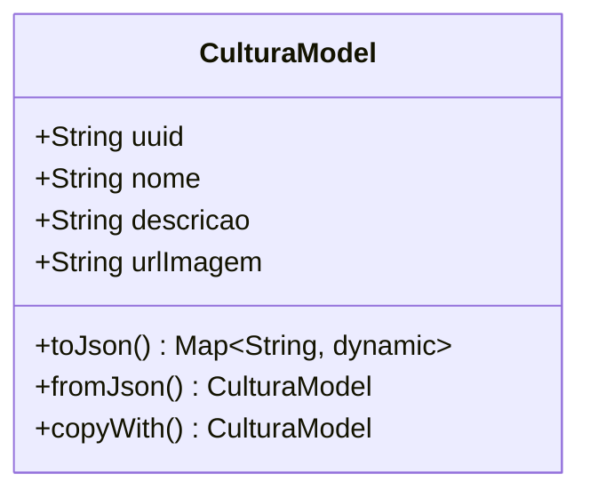

# CulturaModel

## Descrição
Modelo de domínio que representa uma cultura cadastrada no sistema.

## Estrutura

## Relacionamentos

### Referências
- `LoteCulturaModel` --> `CulturaModel` : referencia (via campo cultura)
- `ClienteCulturaModel` --> `CulturaModel` : referencia
- `ClienteCulturaRelacaoModel` --> `CulturaModel` : referencia

## Páginas que Usam
- `CulturaPage` - Cria/edita culturas
- `ExecuteAppointmentPage` - Referencia via pragas identificadas

## Observações
- Implementa `EquatableMixin` para comparação de igualdade
- Campo `urlImagem` armazena URL da imagem da cultura
- Serialização JSON via `json_annotation`

