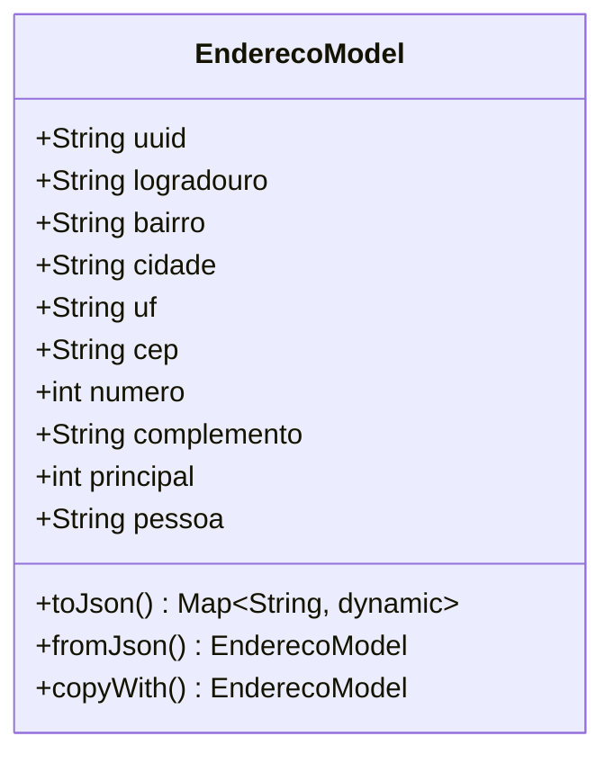

# EnderecoModel

## Descrição
Modelo de domínio que representa um endereço associado a um cliente.

## Estrutura

## Relacionamentos

### Composição
- `ClienteModel` "1" *-- "0..*" `EnderecoModel` : possui endereços

## Páginas que Usam
- `CadastroClientePage` - Cria/edita endereço

## Observações
- Implementa `EquatableMixin` para comparação de igualdade
- Campo `principal` indica se é o endereço principal do cliente
- Campo `pessoa` referencia o UUID do cliente
- Serialização JSON via `json_annotation`

