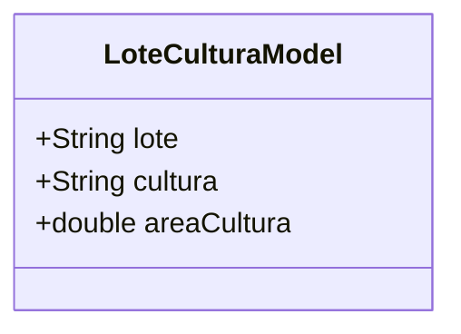

# LoteCulturaModel

## Descrição
Modelo de domínio que representa o relacionamento entre um lote e uma cultura, incluindo a área da cultura no lote.

## Estrutura

## Relacionamentos

### Referências
- `LoteCulturaModel` --> `LoteModel` : referencia (via campo lote)
- `LoteCulturaModel` --> `CulturaModel` : referencia (via campo cultura)
- `LoteModel` "1" *-- "0..*" `LoteCulturaModel` : possui culturas

## Observações
- Representa uma tabela de relacionamento muitos-para-muitos entre Lote e Cultura
- Campo `areaCultura` indica a área em hectares da cultura no lote
- Não possui UUID próprio, usa chave composta (lote + cultura)

