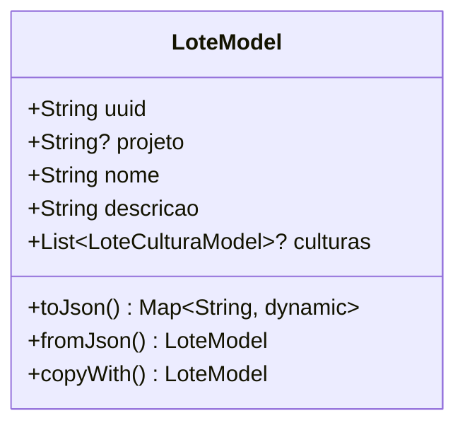

# LoteModel

## Descrição
Modelo de domínio que representa um lote associado a um projeto.

## Estrutura

## Relacionamentos

### Composição
- `LoteModel` "1" *-- "0..*" `LoteCulturaModel` : possui culturas

### Referências
- `ProjetoModel` "1" o-- "0..*" `LoteModel` : contém lotes
- `LoteCulturaModel` --> `LoteModel` : referencia (via campo lote)
- `ClienteCulturaModel` --> `LoteModel` : referencia

## Páginas que Usam
- `LotePage` - Cria/edita/lista lotes
- `ExecuteAppointmentPage` - Referencia via pragas identificadas

## Observações
- Implementa `EquatableMixin` para comparação de igualdade
- Campo `projeto` referencia o UUID do projeto (pode ser nulo)
- Serialização JSON via `json_annotation`

