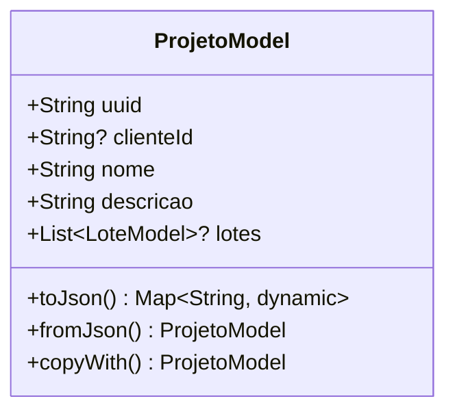

# ProjetoModel

## Descrição
Modelo de domínio que representa um projeto associado a um cliente.

## Estrutura

## Relacionamentos

### Agregação
- `ProjetoModel` "1" o-- "0..*" `LoteModel` : contém lotes

### Referências
- `ProjetoModel` --> `ClienteModel` : pertence a (via clienteId)
- `ClienteCulturaModel` --> `ProjetoModel` : referencia

## Páginas que Usam
- `ProjetoPage` - Cria/edita/lista projetos
- `ClientAppointmentPage` - Referencia via projetos do cliente
- `AppointmentPage` - Referencia via parâmetros

## Observações
- Implementa `EquatableMixin` para comparação de igualdade
- Campo `clienteId` pode ser nulo (TODO: verificar se projeto pode ser NULL)
- Serialização JSON via `json_annotation`

