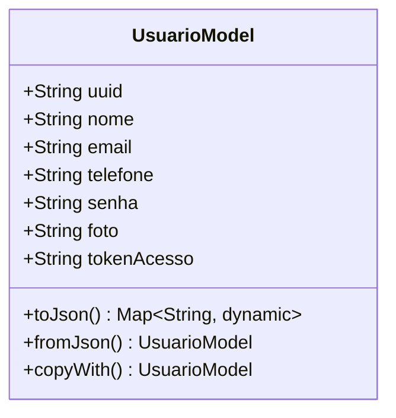

# UsuarioModel

## Descrição
Modelo de domínio que representa um usuário do sistema.

## Estrutura

## Relacionamentos

### Referências
- `AgendaModel` --> `UsuarioModel` : referencia (via campo usuario)

## Observações
- Implementa `EquatableMixin` para comparação de igualdade
- Campo `tokenAcesso` armazena token de autenticação
- Campo `senha` deve ser tratado com segurança (hash)
- Serialização JSON via `json_annotation`

