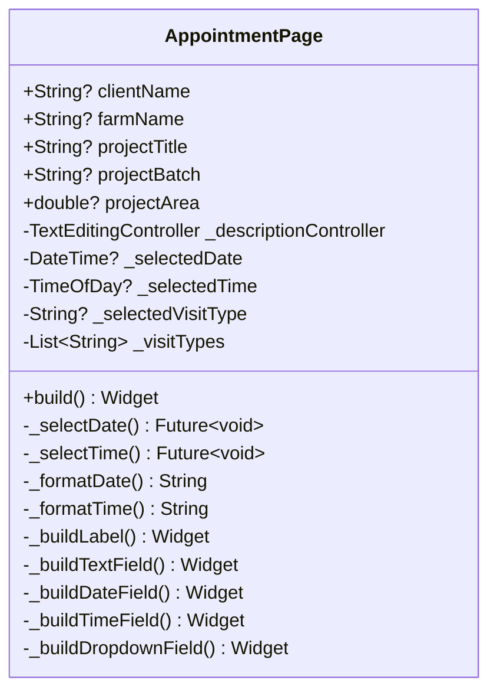

# AppointmentPage

## Descrição
Página para criação de agendamentos de visitas, permitindo selecionar tipo de visita, data, hora e descrição.

## Campos Explícitos

## Campos Implícitos
- `AgendaModel` - Modelo de agendamento criado ao salvar
- `ClienteModel` - Referenciado via parâmetros (`clientName`, `farmName`)
- `ProjetoModel` - Referenciado via parâmetros (`projectTitle`, `projectBatch`, `projectArea`)

## Relacionamentos

### Navegação
- Recebe dados de: `ClientAppointmentPage` (via navegação com argumentos)
- Retorna para: `DashboardPage` (após salvar)

### Dependências
- Cria: `AgendaModel` (ao salvar)
- Referencia: `ClienteModel` (via parâmetros)
- Referencia: `ProjetoModel` (via parâmetros)

## Observações
- Recebe dados do cliente e projeto via parâmetros de navegação
- Tipos de visita pré-definidos: Monitoramento, Tratamento, Consulta, Inspeção, etc.
- Data inicial é hoje e horário padrão é 10:30 AM
- Deve ser integrada com `AgendaViewmodel` para persistência

