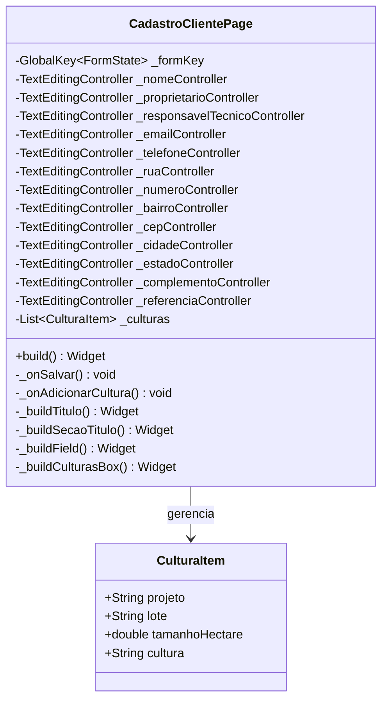

# CadastroClientePage

## Descrição
Página para cadastro e edição de clientes, incluindo dados pessoais, contato, endereço e projetos/culturas.

## Campos Explícitos

## Campos Implícitos
- `ClienteModel` - Modelo de cliente criado/editado
- `EnderecoModel` - Modelo de endereço associado ao cliente
- `CulturaItem` - Lista de projetos/culturas do cliente

## Relacionamentos

### Navegação
- Navega para: `CulturaPage` (via FAB para adicionar cultura)

### Dependências
- Cria/Edita: `ClienteModel`
- Cria/Edita: `EnderecoModel`
- Gerencia: `CulturaItem` (lista de projetos/culturas)

## Observações
- Formulário completo com validação de campos obrigatórios
- Permite adicionar múltiplas culturas/projetos
- Deve ser integrada com `ClienteViewmodel` e `EnderecoViewmodel` para persistência

