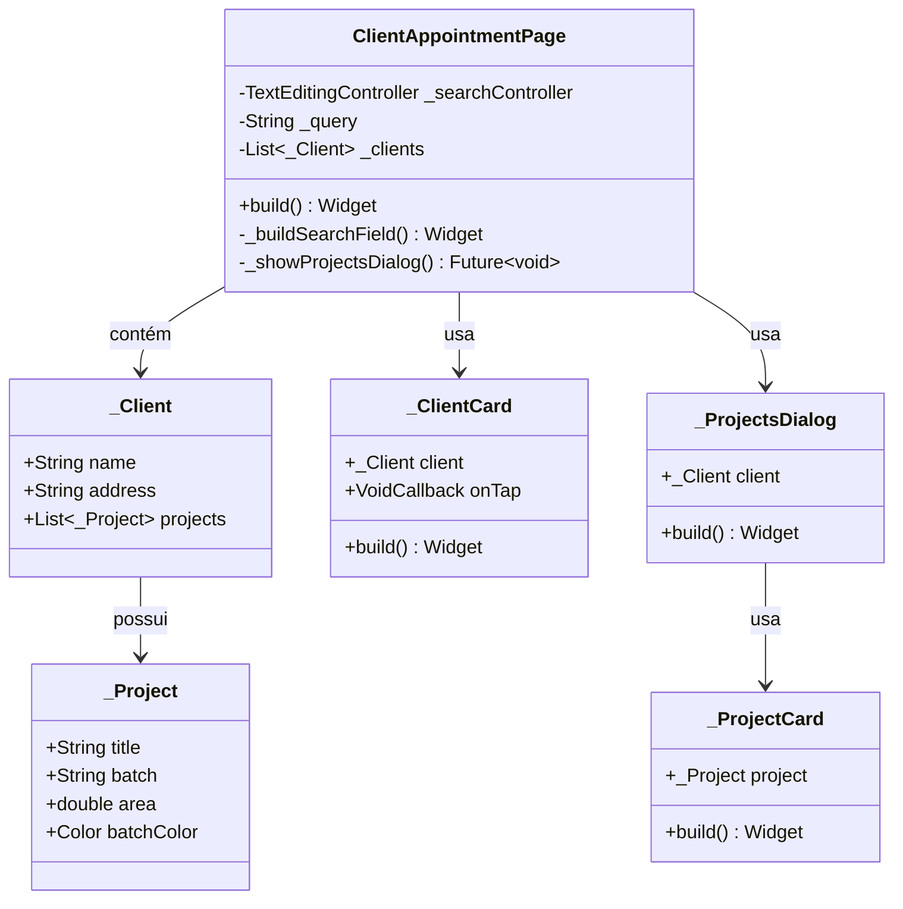

# ClientAppointmentPage

## Descrição
Página para seleção de cliente e projeto para criação de um novo agendamento, exibindo lista de clientes com seus projetos.

## Campos Explícitos

## Campos Implícitos
- `ClienteModel` - Lista de clientes exibidos (atualmente usando dados estáticos)
- `ProjetoModel` - Projetos associados aos clientes (via projetos do cliente)

## Relacionamentos

### Navegação
- Recebe navegação de: `DashboardPage` (via FAB)
- Navega para: `AppointmentPage` (ao selecionar cliente e projeto)

### Dependências
- Lista/Seleciona: `ClienteModel`
- Referencia: `ProjetoModel` (via projetos do cliente)

## Observações
- Atualmente usa lista estática de clientes e projetos
- Exibe diálogo modal para seleção de projeto do cliente
- Deve ser integrada com `ClienteViewmodel` para buscar dados reais
- Permite busca por nome ou endereço do cliente

