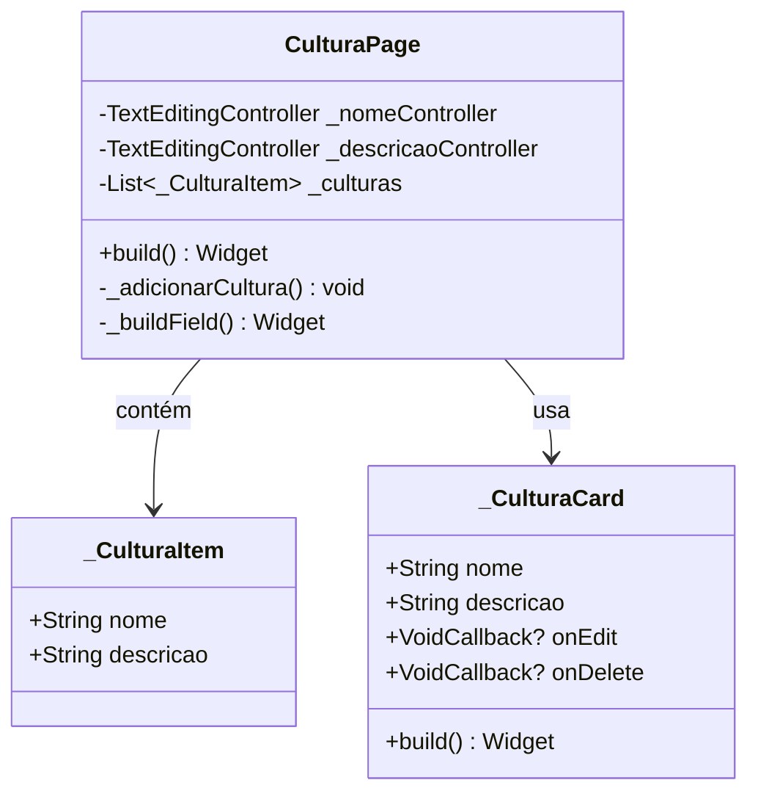

# CulturaPage

## Descrição
Página para gerenciamento de culturas, permitindo adicionar, editar e listar culturas cadastradas.

## Campos Explícitos

## Campos Implícitos
- `CulturaModel` - Modelo de cultura criado/editado

## Relacionamentos

### Navegação
- Retorna para: `CadastroClientePage` (via FAB de salvar)

### Dependências
- Cria/Edita: `CulturaModel`

## Observações
- Atualmente usa lista estática de culturas
- Deve ser integrada com `CulturaViewmodel` para persistência
- Permite edição inline dos itens da lista

