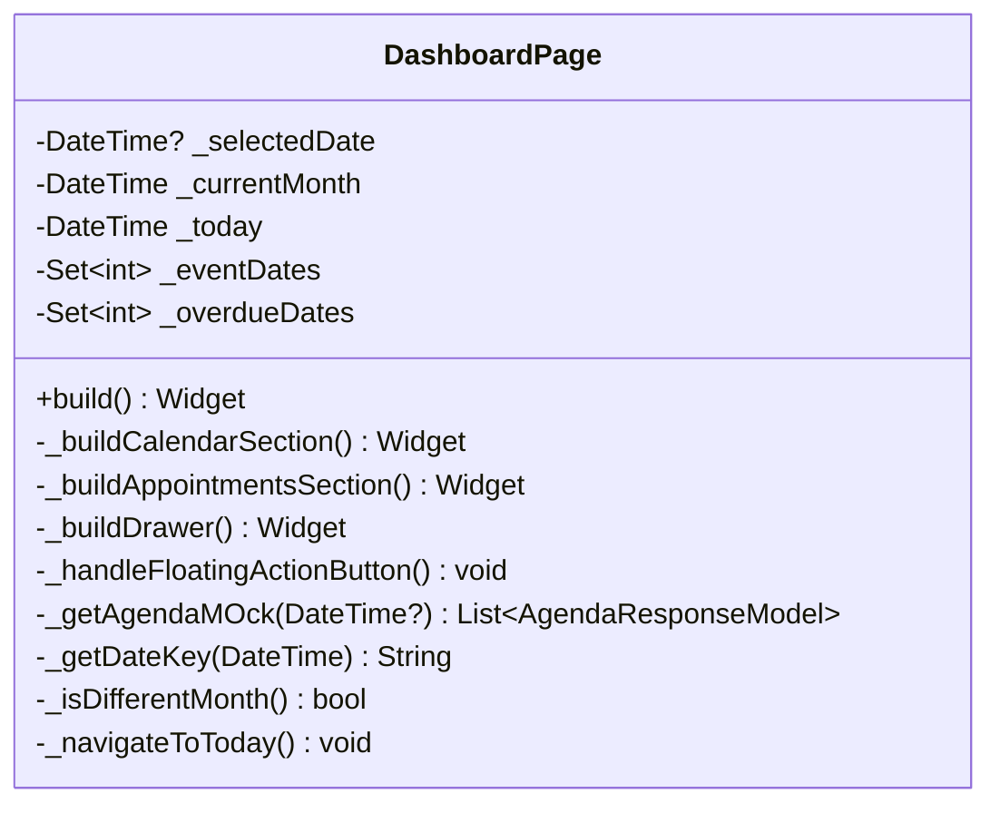

# DashboardPage

## Descrição
Página principal do aplicativo que exibe um calendário com compromissos agendados e permite navegação para outras funcionalidades.

## Campos Explícitos

## Campos Implícitos
- `AgendaResponseModel` - Lista de compromissos exibidos no calendário
- `ClienteModel` - Referenciado através dos compromissos da agenda

## Relacionamentos

### Navegação
- Navega para: `ClientAppointmentPage` (ao clicar no FAB com data selecionada)
- Navega para: `RelacaoClientePage` (via drawer menu)
- Navega para: `ExecuteAppointmentPage` (ao clicar em um compromisso)

### Dependências
- Usa: `AgendaResponseModel` (mock de dados)
- Referencia: `ClienteModel` (via agenda)

## Observações
- A página usa dados mockados (`mockAgendaList`) para exibir os compromissos
- O calendário permite seleção de datas e exibe indicadores visuais para datas com eventos
- Compromissos são filtrados por data selecionada

