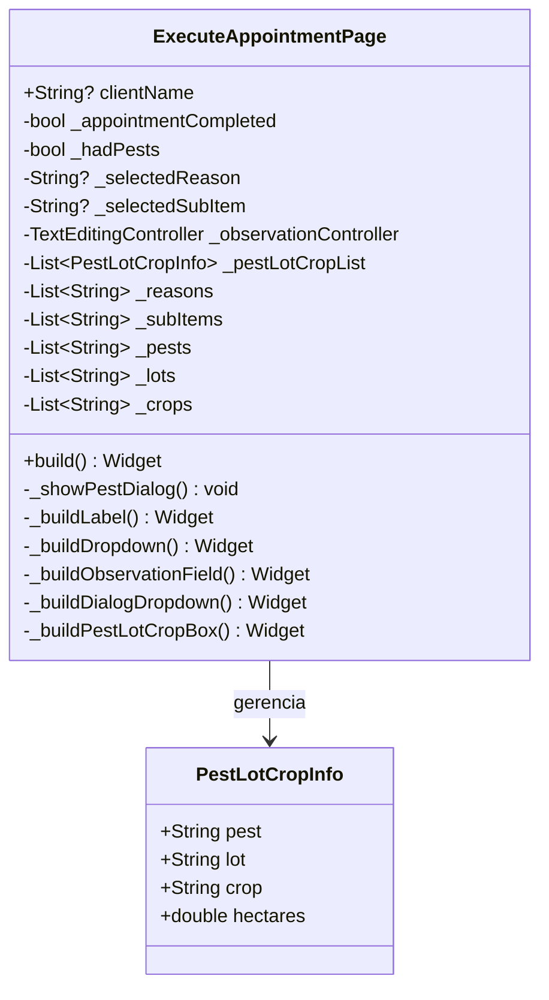

# ExecuteAppointmentPage

## Descrição
Página para completar/executar uma visita agendada, permitindo registrar conclusão, motivo, pragas identificadas e observações.

## Campos Explícitos

## Campos Implícitos
- `AgendaModel` - Modelo de agendamento atualizado/executado
- `ClienteModel` - Referenciado via parâmetro (`clientName`)
- `LoteModel` - Referenciado via pragas identificadas
- `CulturaModel` - Referenciado via pragas identificadas

## Relacionamentos

### Navegação
- Recebe dados de: `DashboardPage` (via navegação com argumentos)
- Retorna para: `DashboardPage` (após completar)

### Dependências
- Atualiza/Executa: `AgendaModel`
- Referencia: `ClienteModel` (via parâmetros)
- Gerencia: `PestLotCropInfo` (lista de pragas identificadas)
- Referencia: `LoteModel` (via pragas)
- Referencia: `CulturaModel` (via pragas)

## Observações
- Permite marcar visita como concluída ou não realizada
- Permite adicionar múltiplas pragas com informações de lote, cultura e hectares
- Motivos de visita pré-definidos: Monitoramento, Tratamento, Consulta, Inspeção
- Deve ser integrada com `AgendaViewmodel` para atualização do agendamento

