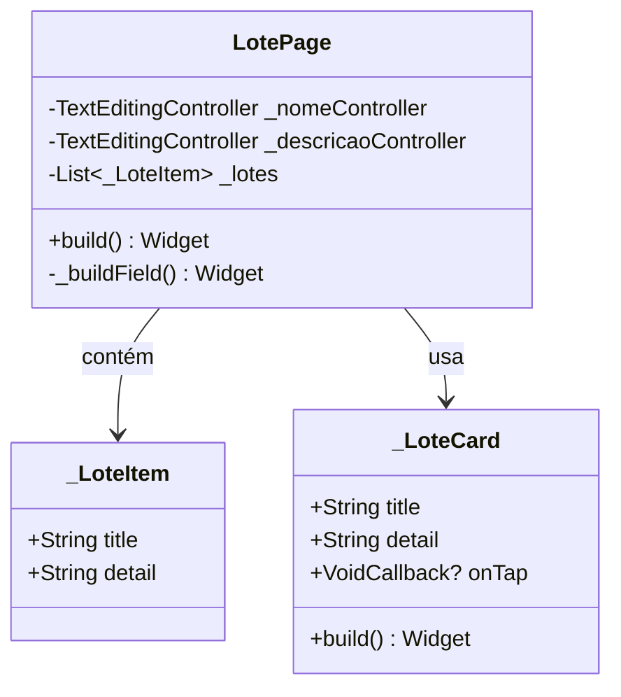

# LotePage

## Descrição
Página para gerenciamento de lotes, permitindo criar, editar e listar lotes associados a um projeto.

## Campos Explícitos

## Campos Implícitos
- `LoteModel` - Modelo de lote criado/editado
- `ProjetoModel` - Projeto ao qual o lote pertence (implícito)

## Relacionamentos

### Navegação
- Navega para: `CulturaPage` (ao clicar em um lote)

### Dependências
- Cria/Edita/Lista: `LoteModel`
- Referencia: `ProjetoModel` (implícito)

## Observações
- Atualmente usa lista estática de lotes
- Deve ser integrada com `LoteViewmodel` para persistência
- Permite edição e exclusão de lotes

