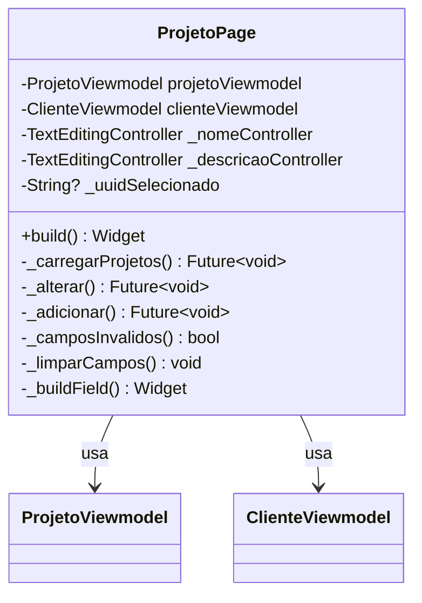

# ProjetoPage

## Descrição
Página para gerenciamento de projetos, permitindo criar, editar, listar e remover projetos associados a um cliente.

## Campos Explícitos

## Campos Implícitos
- `ProjetoModel` - Modelo de projeto criado/editado
- `ClienteModel` - Cliente ao qual o projeto pertence (via viewmodel)

## Relacionamentos

### Navegação
- Navega para: `LotePage` (ao adicionar projeto)

### ViewModels
- Usa: `ProjetoViewmodel` (gerencia projetos)
- Usa: `ClienteViewmodel` (referencia cliente selecionado)

### Dependências
- Cria/Edita/Lista: `ProjetoModel`
- Referencia: `ClienteModel` (via viewmodel)

## Observações
- Única página que usa ViewModels diretamente
- Integrada com `ProjetoViewmodel` para operações CRUD
- Usa `ListenableBuilder` para reagir a mudanças no viewmodel

