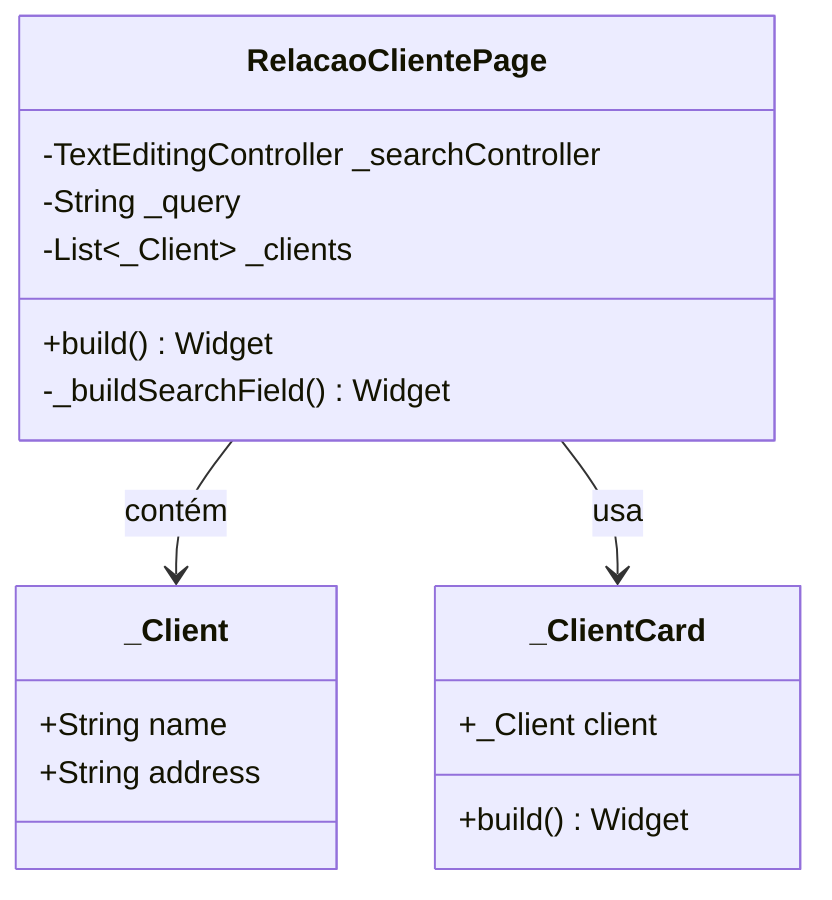

# RelacaoClientePage

## Descrição
Página que exibe uma lista de clientes com funcionalidade de busca e navegação para cadastro/edição.

## Campos Explícitos

## Campos Implícitos
- `ClienteModel` - Lista de clientes exibidos (atualmente usando dados estáticos)

## Relacionamentos

### Navegação
- Navega para: `CadastroClientePage` (ao clicar no FAB ou em um cliente)

### Dependências
- Referencia: `ClienteModel` (lista/exibe)

## Observações
- Atualmente usa uma lista estática de clientes (`_clients`)
- Deve ser integrada com `ClienteViewmodel` para buscar dados reais
- Permite busca por nome ou endereço do cliente

