# Diagrama UML de Classes - Páginas e Models

⚠️ **Este arquivo foi substituído por arquivos individuais organizados por categoria.**

Consulte o [README.md](README.md) para acessar os diagramas organizados.

---

Análise realizada em: 2025-01-27

Este diagrama representa todos os objetos de tela (Pages) encontrados no diretório `lib/views`, seus relacionamentos com Models e ViewModels, baseado nos campos explícitos e implícitos identificados em cada tela.

## Diagrama de Classes

```mermaid
classDiagram
    direction TB

    %% ============================================
    %% PÁGINAS (VIEWS)
    %% ============================================
    
    class DashboardPage {
        -DateTime? _selectedDate
        -DateTime _currentMonth
        -Set~int~ _eventDates
        -Set~int~ _overdueDates
        +build() Widget
        -_buildCalendarSection() Widget
        -_buildAppointmentsSection() Widget
        -_handleFloatingActionButton() void
        -_getAgendaMOck(DateTime?) List~AgendaResponseModel~
    }

    class RelacaoClientePage {
        -TextEditingController _searchController
        -String _query
        -List~_Client~ _clients
        +build() Widget
        -_buildSearchField() Widget
    }

    class CadastroClientePage {
        -GlobalKey~FormState~ _formKey
        -TextEditingController _nomeController
        -TextEditingController _proprietarioController
        -TextEditingController _responsavelTecnicoController
        -TextEditingController _emailController
        -TextEditingController _telefoneController
        -TextEditingController _ruaController
        -TextEditingController _numeroController
        -TextEditingController _bairroController
        -TextEditingController _cepController
        -TextEditingController _cidadeController
        -TextEditingController _estadoController
        -TextEditingController _complementoController
        -TextEditingController _referenciaController
        -List~CulturaItem~ _culturas
        +build() Widget
        -_onSalvar() void
        -_onAdicionarCultura() void
    }

    class CulturaPage {
        -TextEditingController _nomeController
        -TextEditingController _descricaoController
        -List~_CulturaItem~ _culturas
        +build() Widget
        -_adicionarCultura() void
    }

    class ProjetoPage {
        -ProjetoViewmodel projetoViewmodel
        -ClienteViewmodel clienteViewmodel
        -TextEditingController _nomeController
        -TextEditingController _descricaoController
        -String? _uuidSelecionado
        +build() Widget
        -_carregarProjetos() void
        -_alterar() void
        -_adicionar() void
    }

    class LotePage {
        -TextEditingController _nomeController
        -TextEditingController _descricaoController
        -List~_LoteItem~ _lotes
        +build() Widget
    }

    class AppointmentPage {
        +String? clientName
        +String? farmName
        +String? projectTitle
        +String? projectBatch
        +double? projectArea
        -TextEditingController _descriptionController
        -DateTime? _selectedDate
        -TimeOfDay? _selectedTime
        -String? _selectedVisitType
        -List~String~ _visitTypes
        +build() Widget
        -_selectDate() void
        -_selectTime() void
    }

    class ExecuteAppointmentPage {
        +String? clientName
        -bool _appointmentCompleted
        -bool _hadPests
        -String? _selectedReason
        -String? _selectedSubItem
        -TextEditingController _observationController
        -List~PestLotCropInfo~ _pestLotCropList
        +build() Widget
        -_showPestDialog() void
    }

    class ClientAppointmentPage {
        -TextEditingController _searchController
        -String _query
        -List~_Client~ _clients
        +build() Widget
        -_showProjectsDialog() void
    }

    %% ============================================
    %% VIEWMODELS
    %% ============================================
    
    class ClienteViewmodel {
        +ClienteData data
        +buscarTodos() Future~void~
        +adicionar() Future~void~
        +alterar() Future~void~
        +remover() Future~void~
        +changeState() void
    }

    class ProjetoViewmodel {
        +ProjetoData data
        +buscarPorCliente() Future~void~
        +adicionar() Future~void~
        +alterar() Future~void~
        +removerItem() void
    }

    class CulturaViewmodel {
        +CulturaData data
        +buscarTodos() Future~void~
        +adicionar() Future~void~
    }

    class LoteViewmodel {
        +LoteData data
        +buscarPorProjeto() Future~void~
        +adicionar() Future~void~
    }

    class EnderecoViewmodel {
        +EnderecoData data
        +buscarPorCliente() Future~void~
        +adicionar() Future~void~
    }

    class AgendaViewmodel {
        +AgendaData data
        +buscarPorData() Future~void~
        +criar() Future~void~
        +executar() Future~void~
    }

    class UsuarioViewmodel {
        +UsuarioData data
        +login() Future~void~
        +logout() void
    }

    %% ============================================
    %% MODELS (DOMAIN)
    %% ============================================
    
    class ClienteModel {
        +String uuid
        +String nome
        +String email
        +String celular
        +String observacao
        +String proprietario
        +String responsavelTecnico
        +List~EnderecoModel~? enderecos
        +toRequestModel() ClienteRequestModel
    }

    class EnderecoModel {
        +String uuid
        +String logradouro
        +String bairro
        +String cidade
        +String uf
        +String cep
        +int numero
        +String complemento
        +int principal
        +String pessoa
    }

    class ProjetoModel {
        +String uuid
        +String? clienteId
        +String nome
        +String descricao
        +List~LoteModel~? lotes
    }

    class LoteModel {
        +String uuid
        +String? projeto
        +String nome
        +String descricao
        +List~LoteCulturaModel~? culturas
    }

    class CulturaModel {
        +String uuid
        +String nome
        +String descricao
        +String urlImagem
    }

    class LoteCulturaModel {
        +String lote
        +String cultura
        +double areaCultura
    }

    class AgendaModel {
        +String id
        +String usuario
        +String cliente
        +String dataHoraCriacao
        +String descricao
        +String motivo
        +int situacao
        +String observacao
    }

    class AgendaResponseModel {
        +String uuid
        +int dataCriacao
        +int dataAgenda
        +ClienteResponseModel cliente
        +String descricao
        +MotivoAgendaResponseModel motivo
        +int situacao
        +String? kmAtendimento
        +String? observacao
    }

    class ClienteCulturaModel {
        +String cliente
        +String cultura
        +double area
        +String projeto
        +String lote
    }

    class UsuarioModel {
        +String uuid
        +String nome
        +String email
        +String telefone
        +String senha
        +String foto
        +String tokenAcesso
    }

    %% ============================================
    %% CLASSES AUXILIARES (INTERNAS DAS PÁGINAS)
    %% ============================================
    
    class CulturaItem {
        +String projeto
        +String lote
        +double tamanhoHectare
        +String cultura
    }

    class PestLotCropInfo {
        +String pest
        +String lot
        +String crop
        +double hectares
    }

    %% ============================================
    %% RELACIONAMENTOS - PÁGINAS COM VIEWMODELS
    %% ============================================
    
    ProjetoPage --> ClienteViewmodel : usa
    ProjetoPage --> ProjetoViewmodel : usa
    
    %% ============================================
    %% RELACIONAMENTOS - VIEWMODELS COM MODELS
    %% ============================================
    
    ClienteViewmodel --> ClienteModel : gerencia
    ClienteViewmodel --> EnderecoModel : gerencia
    ClienteViewmodel --> ClienteCulturaModel : gerencia
    
    ProjetoViewmodel --> ProjetoModel : gerencia
    ProjetoViewmodel --> ClienteModel : referencia
    
    CulturaViewmodel --> CulturaModel : gerencia
    
    LoteViewmodel --> LoteModel : gerencia
    LoteViewmodel --> ProjetoModel : referencia
    
    EnderecoViewmodel --> EnderecoModel : gerencia
    EnderecoViewmodel --> ClienteModel : referencia
    
    AgendaViewmodel --> AgendaModel : gerencia
    AgendaViewmodel --> AgendaResponseModel : usa
    AgendaViewmodel --> ClienteModel : referencia
    AgendaViewmodel --> UsuarioModel : referencia
    
    UsuarioViewmodel --> UsuarioModel : gerencia
    
    %% ============================================
    %% RELACIONAMENTOS - PÁGINAS COM MODELS (IMPLÍCITOS)
    %% ============================================
    
    DashboardPage ..> AgendaResponseModel : exibe
    DashboardPage ..> ClienteModel : referencia (via agenda)
    
    RelacaoClientePage ..> ClienteModel : lista/exibe
    
    CadastroClientePage ..> ClienteModel : cria/edita
    CadastroClientePage ..> EnderecoModel : cria/edita
    CadastroClientePage --> CulturaItem : gerencia
    
    CulturaPage ..> CulturaModel : cria/edita
    
    ProjetoPage ..> ProjetoModel : cria/edita/lista
    ProjetoPage ..> ClienteModel : referencia
    
    LotePage ..> LoteModel : cria/edita/lista
    LotePage ..> ProjetoModel : referencia (implícito)
    
    AppointmentPage ..> AgendaModel : cria
    AppointmentPage ..> ClienteModel : referencia (via parâmetros)
    AppointmentPage ..> ProjetoModel : referencia (via parâmetros)
    
    ExecuteAppointmentPage ..> AgendaModel : atualiza/executa
    ExecuteAppointmentPage ..> ClienteModel : referencia
    ExecuteAppointmentPage --> PestLotCropInfo : gerencia
    ExecuteAppointmentPage ..> LoteModel : referencia (via pragas)
    ExecuteAppointmentPage ..> CulturaModel : referencia (via pragas)
    
    ClientAppointmentPage ..> ClienteModel : lista/seleciona
    ClientAppointmentPage ..> ProjetoModel : referencia (via projetos do cliente)
    
    %% ============================================
    %% RELACIONAMENTOS - MODELS ENTRE SI
    %% ============================================
    
    ClienteModel "1" *-- "0..*" EnderecoModel : possui
    ProjetoModel "1" o-- "0..*" LoteModel : contém
    LoteModel "1" *-- "0..*" LoteCulturaModel : possui
    LoteCulturaModel --> CulturaModel : referencia
    ProjetoModel --> ClienteModel : pertence a
    AgendaModel --> ClienteModel : referencia
    AgendaModel --> UsuarioModel : referencia
    ClienteCulturaModel --> ClienteModel : referencia
    ClienteCulturaModel --> CulturaModel : referencia
    ClienteCulturaModel --> ProjetoModel : referencia
    ClienteCulturaModel --> LoteModel : referencia
    
    %% ============================================
    %% RELACIONAMENTOS - NAVEGAÇÃO ENTRE PÁGINAS
    %% ============================================
    
    DashboardPage --> ClientAppointmentPage : navega para
    ClientAppointmentPage --> AppointmentPage : navega para
    AppointmentPage --> DashboardPage : retorna para
    ExecuteAppointmentPage --> DashboardPage : retorna para
    
    RelacaoClientePage --> CadastroClientePage : navega para
    CadastroClientePage --> CulturaPage : navega para (via FAB)
    CulturaPage --> CadastroClientePage : retorna para
    
    ProjetoPage --> LotePage : navega para
    LotePage --> CulturaPage : navega para
    
    DashboardPage --> RelacaoClientePage : navega para (via drawer)
```

## Legenda

- **Páginas (Pages)**: Classes que representam as telas da aplicação
- **ViewModels**: Classes que gerenciam o estado e a lógica de negócio das páginas
- **Models**: Classes que representam as entidades de domínio
- **Classes Auxiliares**: Classes internas usadas apenas dentro de uma página específica

## Relacionamentos

- `-->` : Relacionamento de uso/dependência direta
- `..>` : Relacionamento implícito (uso indireto através de dados)
- `*--` : Composição (1 para muitos)
- `o--` : Agregação (1 para muitos)

## Observações Importantes

### Campos Explícitos vs Implícitos

1. **DashboardPage**:
   - Explícitos: `_selectedDate`, `_currentMonth`, `_eventDates`, `_overdueDates`
   - Implícitos: `AgendaResponseModel` (via mock), `ClienteModel` (via agenda)

2. **CadastroClientePage**:
   - Explícitos: Todos os campos de formulário (nome, email, telefone, endereço completo)
   - Implícitos: `ClienteModel`, `EnderecoModel`, `CulturaItem` (projetos/culturas)

3. **AppointmentPage**:
   - Explícitos: `clientName`, `farmName`, `projectTitle`, `projectBatch`, `projectArea`, `_descriptionController`, `_selectedDate`, `_selectedTime`, `_selectedVisitType`
   - Implícitos: `AgendaModel` (ao salvar), `ClienteModel`, `ProjetoModel` (via parâmetros)

4. **ExecuteAppointmentPage**:
   - Explícitos: `clientName`, `_appointmentCompleted`, `_hadPests`, `_selectedReason`, `_observationController`, `_pestLotCropList`
   - Implícitos: `AgendaModel`, `LoteModel`, `CulturaModel` (via pragas identificadas)

5. **ProjetoPage**:
   - Explícitos: `_nomeController`, `_descricaoController`, `_uuidSelecionado`
   - Implícitos: `ProjetoModel`, `ClienteModel` (via viewmodel)

6. **ClientAppointmentPage**:
   - Explícitos: `_searchController`, `_clients` (lista interna)
   - Implícitos: `ClienteModel`, `ProjetoModel` (via projetos do cliente)

### Fluxo de Navegação Principal

1. **Dashboard** → Seleciona data → **ClientAppointment** → Seleciona cliente/projeto → **Appointment** → Cria agendamento → Retorna ao **Dashboard**
2. **Dashboard** → Visualiza compromisso → **ExecuteAppointment** → Completa visita → Retorna ao **Dashboard**
3. **RelacaoCliente** → **CadastroCliente** → Adiciona cultura → **CulturaPage** → Retorna ao **CadastroCliente**
4. **ProjetoPage** → Adiciona projeto → **LotePage** → Adiciona lote → **CulturaPage**

### Dependências de ViewModels

- **ProjetoPage** é a única página que usa ViewModels diretamente (ProjetoViewmodel e ClienteViewmodel)
- As demais páginas trabalham com dados estáticos ou mockados, mas devem ser integradas com seus respectivos ViewModels

