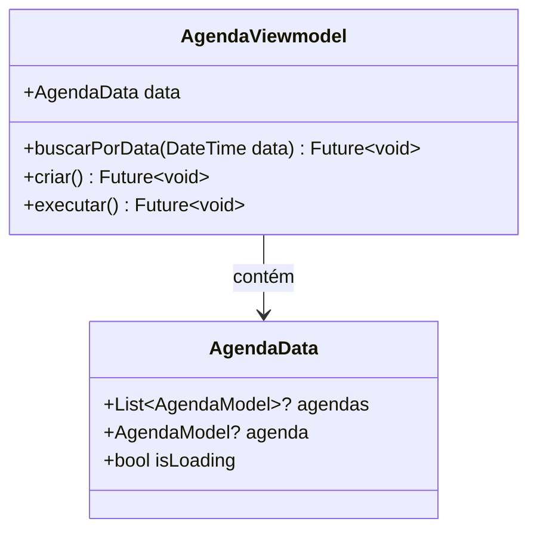

# AgendaViewmodel

## Descrição
ViewModel responsável por gerenciar o estado e operações relacionadas a agendamentos/compromissos.

## Estrutura

## Relacionamentos

### Models Gerenciados
- `AgendaModel` - Gerencia operações CRUD
- `AgendaResponseModel` - Usa para resposta da API
- `ClienteModel` - Referencia cliente do agendamento
- `UsuarioModel` - Referencia usuário que criou o agendamento

### Páginas que Usam
- Nenhuma página usa diretamente ainda (deve ser integrado com `DashboardPage`, `AppointmentPage`, `ExecuteAppointmentPage`)

## Observações
- Estende `ChangeNotifier` para notificar mudanças de estado
- Deve ser injetado via `Modular.get<AgendaViewmodel>()`
- Precisa ser integrado com as páginas de agendamento para substituir dados mockados

