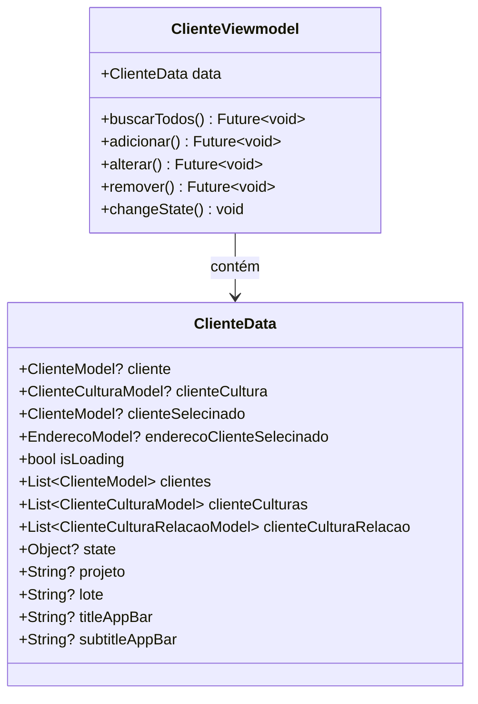

# ClienteViewmodel

## Descrição
ViewModel responsável por gerenciar o estado e operações relacionadas a clientes.

## Estrutura

## Relacionamentos

### Models Gerenciados
- `ClienteModel` - Gerencia operações CRUD
- `EnderecoModel` - Gerencia endereços dos clientes
- `ClienteCulturaModel` - Gerencia relacionamento cliente-cultura

### Páginas que Usam
- `ProjetoPage` - Usa para referenciar cliente selecionado

## Observações
- Estende `ChangeNotifier` para notificar mudanças de estado
- Gerencia estado complexo através de `ClienteData`
- Deve ser injetado via `Modular.get<ClienteViewmodel>()`

