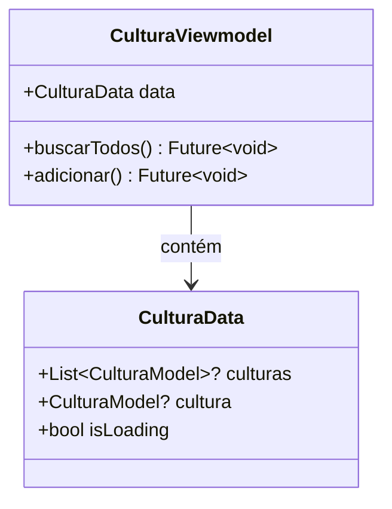

# CulturaViewmodel

## Descrição
ViewModel responsável por gerenciar o estado e operações relacionadas a culturas.

## Estrutura

## Relacionamentos

### Models Gerenciados
- `CulturaModel` - Gerencia operações CRUD

### Páginas que Usam
- Nenhuma página usa diretamente ainda (deve ser integrado com `CulturaPage`)

## Observações
- Estende `ChangeNotifier` para notificar mudanças de estado
- Deve ser injetado via `Modular.get<CulturaViewmodel>()`
- Precisa ser integrado com `CulturaPage` para substituir dados estáticos

