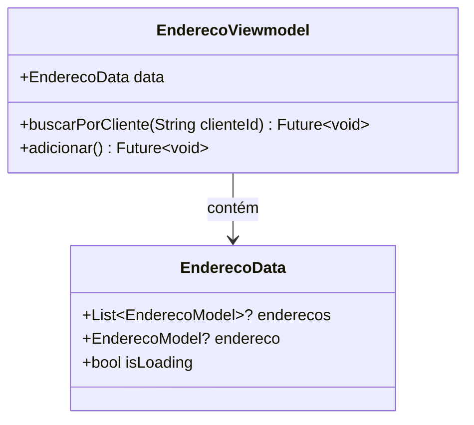

# EnderecoViewmodel

## Descrição
ViewModel responsável por gerenciar o estado e operações relacionadas a endereços.

## Estrutura

## Relacionamentos

### Models Gerenciados
- `EnderecoModel` - Gerencia operações CRUD
- `ClienteModel` - Referencia cliente ao qual o endereço pertence

### Páginas que Usam
- Nenhuma página usa diretamente ainda (deve ser integrado com `CadastroClientePage`)

## Observações
- Estende `ChangeNotifier` para notificar mudanças de estado
- Operações são filtradas por cliente (`buscarPorCliente`)
- Deve ser injetado via `Modular.get<EnderecoViewmodel>()`
- Precisa ser integrado com `CadastroClientePage` para persistência de endereços

