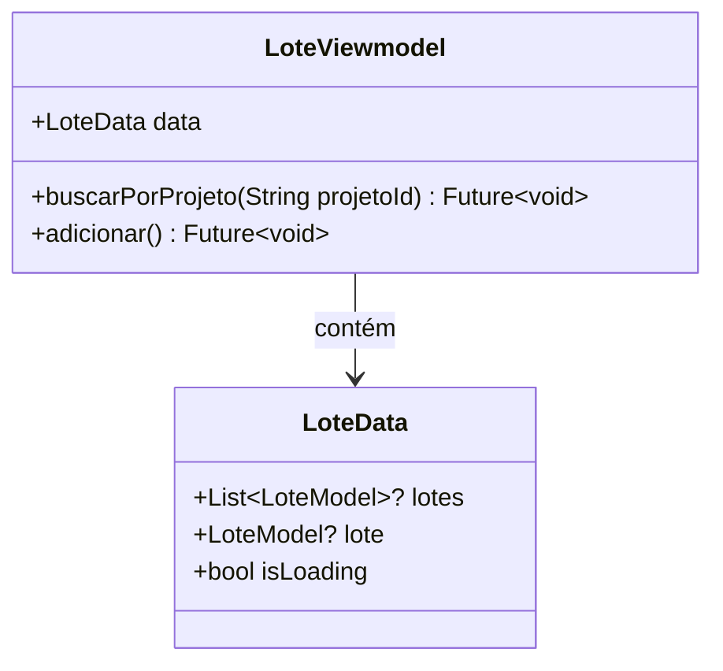

# LoteViewmodel

## Descrição
ViewModel responsável por gerenciar o estado e operações relacionadas a lotes.

## Estrutura

## Relacionamentos

### Models Gerenciados
- `LoteModel` - Gerencia operações CRUD
- `ProjetoModel` - Referencia projeto ao qual o lote pertence

### Páginas que Usam
- Nenhuma página usa diretamente ainda (deve ser integrado com `LotePage`)

## Observações
- Estende `ChangeNotifier` para notificar mudanças de estado
- Operações são filtradas por projeto (`buscarPorProjeto`)
- Deve ser injetado via `Modular.get<LoteViewmodel>()`
- Precisa ser integrado com `LotePage` para substituir dados estáticos

