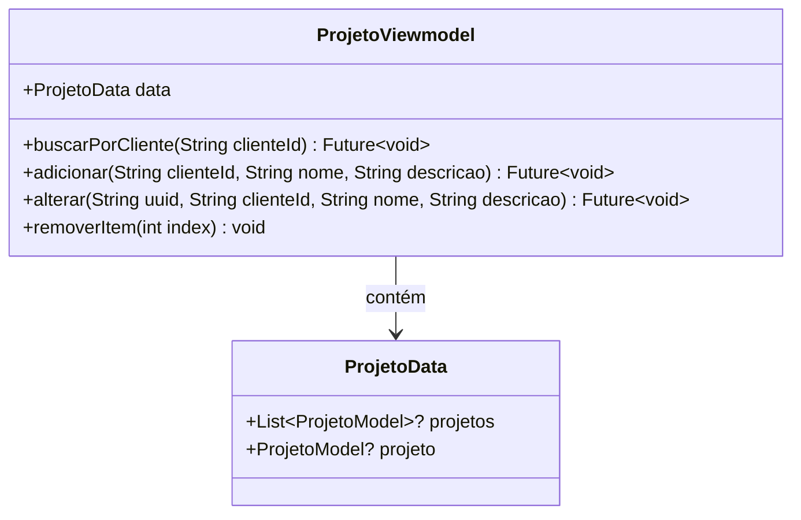

# ProjetoViewmodel

## Descrição
ViewModel responsável por gerenciar o estado e operações relacionadas a projetos.

## Estrutura

## Relacionamentos

### Models Gerenciados
- `ProjetoModel` - Gerencia operações CRUD
- `ClienteModel` - Referencia cliente ao qual o projeto pertence

### Páginas que Usam
- `ProjetoPage` - Usa diretamente para gerenciar projetos

## Observações
- Estende `ChangeNotifier` para notificar mudanças de estado
- Operações são filtradas por cliente (`buscarPorCliente`)
- Deve ser injetado via `Modular.get<ProjetoViewmodel>()`

