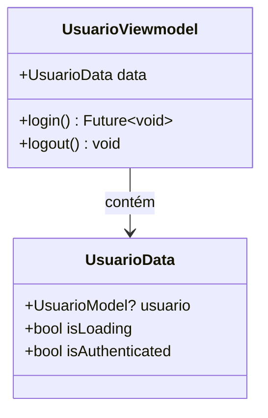

# UsuarioViewmodel

## Descrição
ViewModel responsável por gerenciar o estado e operações relacionadas a usuários e autenticação.

## Estrutura

## Relacionamentos

### Models Gerenciados
- `UsuarioModel` - Gerencia dados do usuário autenticado

### Páginas que Usam
- Nenhuma página usa diretamente ainda (deve ser integrado com página de login)

## Observações
- Estende `ChangeNotifier` para notificar mudanças de estado
- Gerencia autenticação e sessão do usuário
- Deve ser injetado via `Modular.get<UsuarioViewmodel>()`

